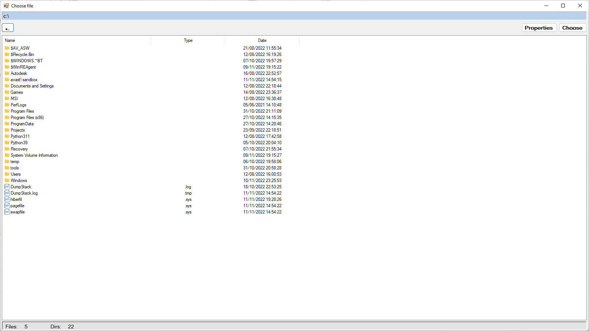
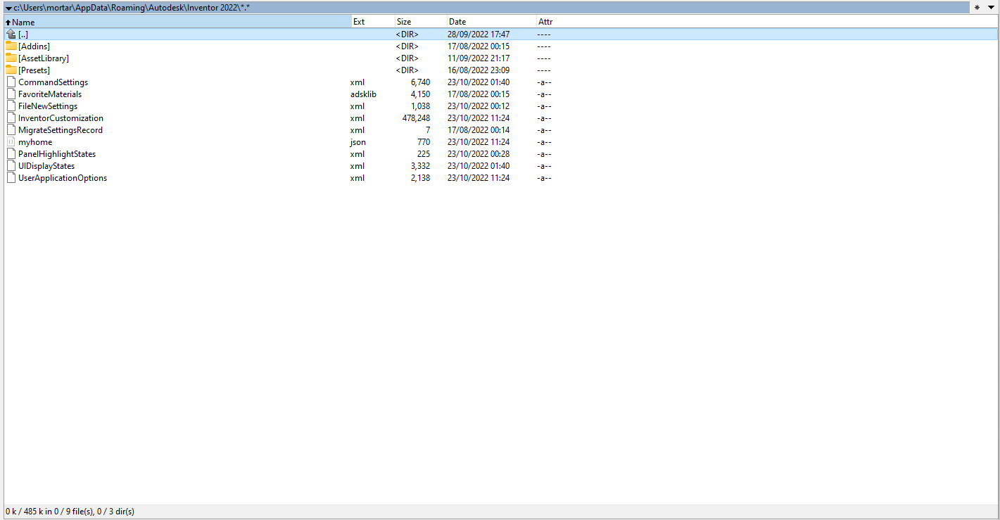

# File chooser
## Task
    The task was to make a own file chooser and use 2 custom components in it.
    -   My first custom component is a directory properties bar on the bottom of screen. The bar displays count of files and directories in current directory.
    -   Second component is a file properties display. The display automatically displays all properties of current file or directory which is given by parameter in constructor of display.
    
## How to use
    -   To choose file just click on him press Choose button in up right corner of screen or double click on the file.
        This operation then generates an event with the path to the selected file in parameter, and we can then use this event in the rest of the program.
    -   To go in some folder double click on it in the list.
    -   To go to parent folder press button with back arrow in up left corner of screen.
    -   Path to current selected file is displayed in light blue bar on the top.
    -   To display file properties right click on the file and select Properties from Context Menu Strip that will displays or press button Properties in up right corner of screen.

## Final design of gui

## Example design of gui for inspiration
